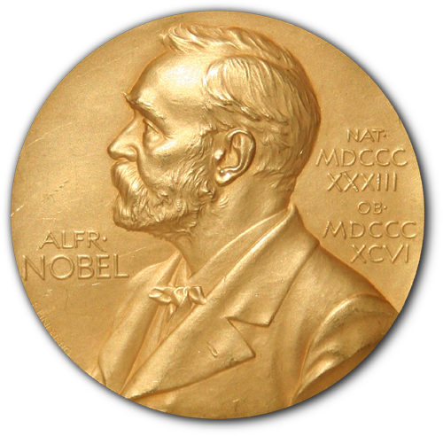

# [A Visual History of Nobel Prize Winners](https://mohitur669.github.io/Nobel-Prize-Winner-Analysis/)

# Introduction

The Nobel Prize is perhaps the world's most well known scientific award. Every year it is given to scientists and scholars in chemistry, literature, physics, medicine, economics, and peace. The first Nobel Prize was handed out in 1901, and at that time the prize was Eurocentric and male-focused, but nowadays it's not biased in any way. Surely, right?

Well, let's find out! What characteristics do the prize winners have? Which country gets it most often? And has anybody gotten it twice?

So, this is an Exploratory Data Analysis Project to analyze and explore the patterns or trends over 100 years worth of Nobel Prize Winners from 1901 to 2016. 

# Data Source
The [dataset](https://www.kaggle.com/nobelfoundation/nobel-laureates) used in this project is from The Nobel Foundation on Kaggle. The dataset is a collection of all the Nobel Laureates from 1901 to 2016. It is in CSV format. It contains 911 rows and 18 columns. The columns are as follows:

* `Year` - Year of the award
* `Category` - Category of the award
* `Prize` - Prize name
* `Motivation` - Reason for the award
* `Prize Share` - Number of people who shared the award in a given year
* `Laureate ID` - ID of the laureate
* `Laureate Type` - Type of laureate
* `Full Name` - Full name of the laureate
* `Birth Date` - Date of birth of the laureate
* `Birth City` - City of birth of the laureate
* `Birth Country` - Country of birth of the laureate

# Data Analysis
The data analysis is done in the following steps:
## 1. ASK
The following are the questions that will be answered in this project:

* The most Nobel of Prizes
* So, who gets the Nobel Prize?
* USA dominance
* USA dominance, visualized
* What is the gender of a typical Nobel Prize winner?
* The first woman to win the Nobel Prize
* Repeat laureates
* How old are you when you get the prize?
* Age differences between prize categories
* Oldest and youngest winners
* You get a prize!

## 2. PREPARE
The dataset is pretty clean. There are no missing values. The only thing that needs to be done is to convert the `Birth Date` column to a datetime object.

## 3. PROCESS
The data is processed to answer the questions asked in the ASK step. The data is processed to answer the questions asked in the ASK step. 

## 4. ANALYZE
After preparing and processing the data, the data is analyzed to determine the answers of the given questions in the **ASK** section. The required processes had been shown in the `Nobel Prize Winners.Rmd`.

## 5. SHARE
To view the analysis, you can open `Nobel Prize Winners.Rmd` file in RStudio to view it properly or else you can directly open the `Nobel Prize Winners.nb.html` file.

This file is also hosted in Github Pages so that you can watch it's code and output including the visualizations without running it again.

# How to run the project locally
1. Clone the repository using `https://github.com/Mohitur669/Nobel-Prize-Winner-Analysis` in the terminal
2. Run the command `cd Nobel-Prize-Winner-Analysis` to view all the files
3. Open `Nobel Prize Winners.Rmd` using only RStudio
4. Follow the instructions mentioned in `Nobel Prize Winners.Rmd`
5. Or else you can open the `Nobel Prize Winners.nb.html` to view the analysis directly

# About me
I am Mohd Mohitur Rahaman, and currently, I am pursuing MCA from KIIT University, Bhubaneswar. Talking about my previous educational background, I did my BSC in Mathematics at Malda College.

- [Mohitur](https://linktr.ee/mohitur)

# Feedback
If you have any feedback, you can make the changes and create a pull request or, please reach out to me at [here](mohitur669@gmail.com) or [LinkedIn](https://www.linkedin.com/in/mohitur02).
